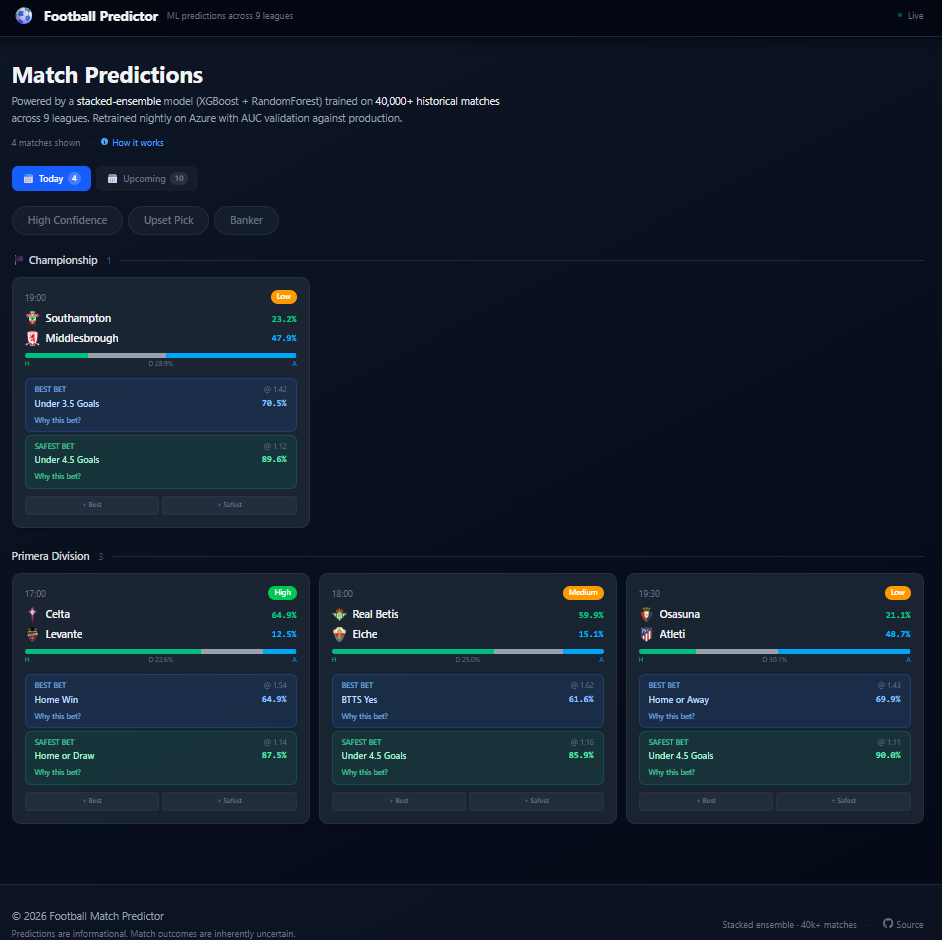
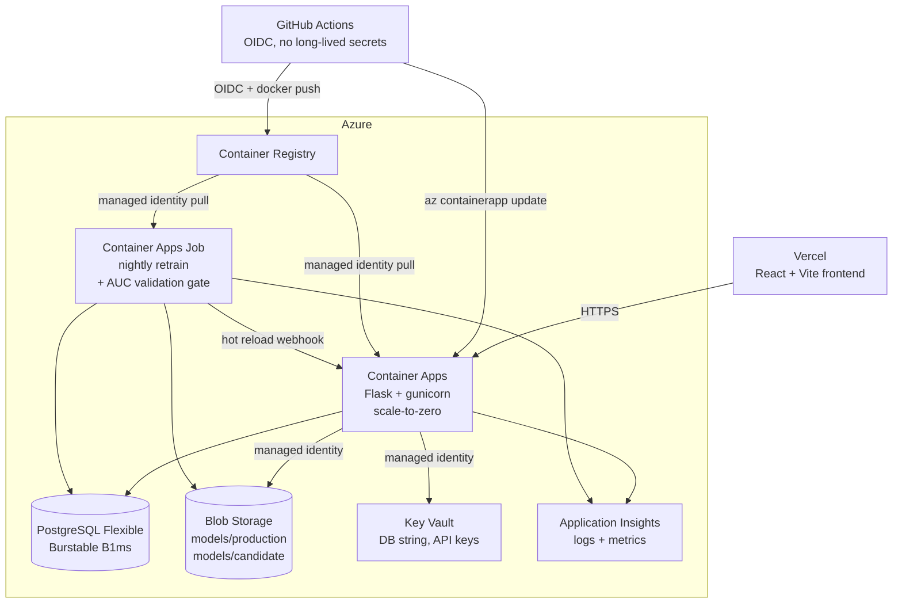

# Football Match Predictor

A full-stack machine learning application that predicts football match outcomes across multiple betting markets. Production model is a stacked ensemble (XGBoost + RandomForest with a logistic-regression meta-learner) trained on 9 European leagues with 40,000+ historical matches.


## Live Demo

- **Frontend**: [football-match-predictor-pearl.vercel.app](https://football-match-predictor-pearl.vercel.app)
- **API**: Azure Container Apps (scale-to-zero — first request after idle takes ~5–10 sec to spin up)
- **Model**: Stacked ensemble (XGBoost + Random Forest + Logistic Regression) — AUC 0.638, 49.8% accuracy on the 3-class match outcome, measured on a chronological 15% holdout (6,396 matches to 2026-05)



## Highlights

- **Hybrid cloud architecture** — Vercel for frontend, Azure for backend, ML, and data
- **Container Apps with managed identity** — zero-trust auth to Storage, Key Vault, ACR (no secrets in env vars)
- **Infrastructure as Code** — full Bicep, `az deployment group create` rebuilds the entire stack
- **CI/CD via GitHub Actions + OIDC** — no long-lived credentials in GitHub
- **MLOps with validation gates** — nightly retraining job trains the same stacked-ensemble architecture as production; new model must hold AUC within 0.02 of the deployed model before promotion
- **Leakage-safe training** — chronological train/test split; expanding-window stacking so the meta-learner only sees out-of-time base predictions; **point-in-time league tables** rebuilt from results before each kickoff; constant rest-day imputation; Elo computed only from past matches
- **Model audit trail** — rejected candidates preserved in `models/candidate/` with timestamps; promoted models versioned as `best_model_YYYYMMDDTHHMMSS.pkl` with manifest (`latest.json`) recording AUC before/after, holdout size, and training set size
- **Defensive API surface** — admin endpoints (model reload, fixture refresh) gated by constant-time token check; sanitized error responses (no stack traces or SQL fragments leak to clients); request body capped at 256 KB; query params clamped
- **Observability** — Application Insights with structured logs and custom metrics

## Features

### Prediction surface
- **Multi-market predictions** — Match result (H/D/A), Double Chance, BTTS, Over/Under 2.5, Half-Time result, Corners, Cards
- **Combo bets** — Result+BTTS, Result+O/U, BTTS+O/U combinations with combined probabilities
- **Smart bet recommendations** — "Best Bet" (highest edge) and "Safest Bet" (highest probability) with model-driven reasoning
- **Slip-based accumulator** — Stack picks across matches and markets from the dashboard or inside the match detail; auto-routes to a single-bet or combo POST at log time
- **Match tagging** — High Confidence, Upset Pick, Banker classifications
- **Nightly retrain** — Container Apps Job runs at 03:00 UTC: pulls fresh fixtures, retrains the stacked ensemble with TimeSeriesSplit CV, validates AUC against production on a time-based holdout, promotes or rejects
- **9 leagues** — Premier League, Championship, La Liga, Bundesliga, Serie A, Ligue 1, Eredivisie, Primeira Liga, Champions League

### Value-betting workflow (advanced mode)
- **+EV picks** — `/api/value-bets` joins model probabilities to live bookmaker odds (The Odds API) and surfaces picks above a configurable edge threshold, gated against the *median* of trusted sharp books rather than the best price to suppress palp-error noise
- **Best Picks ranking** — top-N cross-league picks ranked by ¼-Kelly × ensemble agreement; embeds edge, probability, and model confidence into a single score
- **Manual NT odds entry** — operator types Norsk Tipping odds inline per pick; the UI shows *edge vs NT* alongside edge vs sharp median (NT margins are 8–12% vs ~2–3% on Pinnacle, so the sharp edge is an upper bound)
- **Combo presets** — auto-generated Safest / Best-edge / Treble suggestions with combined margin drag and Kelly-adjusted stake
- **Compound markets** — BTTS & Win combinations priced from the model, with manual NT odds entry for edge discovery
- **Paper bet logging + automatic settlement** — `POST /api/bets` and `/api/bets/combo` record single and multi-leg bets; settler runs on read so finished matches resolve in-place. Tri-state resolution (won / lost / **void**) prevents auto-LOSS when half-time, corners, or cards data is missing
- **Performance hub** — ROI, hit rate, CLV vs the de-vigged closing line, edge calibration, segment breakdowns by market / league / month, activity feed of recently settled bets
- **Bet-write auth** — `X-Bet-Token` shared-secret header on writes; read endpoints stay public. Frontend bootstraps the token from a `?bet_token=` URL param into localStorage

### Quota- and infra-aware design
- **Persistent odds cache** — JSON-backed file cache (`backend/data/odds_cache.json`) with 7-day TTL, env-overridable; survives container restarts so the free-tier 500 req/month budget isn't burned on every cold start
- **Circuit breaker** — refuses to fetch when remaining quota ≤ floor (default 20), protecting the emergency reserve from buggy callers
- **Manual refresh** — `POST /api/admin/odds-refresh` drops the cache so the next fetch repopulates with current prices; surfaced in the UI as a "Refresh odds" button only for operators with a bet-write token
- **Calibration view** — bucketed prediction-probability vs actual outcome rate, with sample-size strip and selectable timeframe / league filters
- **Mobile-responsive** — `<sm` breakpoint renders the bet log as a card stack, the Performance Hub as a vertical KPI strip, and adds a fixed bottom tab nav for primary navigation

## Architecture



### A note on the reported metrics

An earlier version of this README quoted AUC 0.79. That figure came from a pipeline
with two defects, both since fixed:

- **League-table leakage.** Standings were stored as end-of-season tables and read
  with no date filter, so a match played in September was featurised with the table
  from the following May. Measured cost: the same model scored **AUC 0.666** on its
  own holdout but **0.607** when fed the standings production actually supplies — a
  0.059 illusion. With point-in-time tables the pipeline reports **0.638**, which is
  0.032 *better* than what was really being served.
- **Fragmented club identities.** Synthetic CSV team IDs were derived from Python's
  per-process-randomised `hash()`, so re-loads minted new identities; clubs present
  in both data sources also got one row per source. Features key on `team_id`, so a
  club with four identities had its form and head-to-head built from a quarter of its
  history. 3,537 team rows collapsed to 434 after repair
  (`jobs/remap_synthetic_team_ids.py`).

The lower number is the honest one. Combo probabilities remain products of marginal
probabilities and are flagged `independence_assumed` in the API — real outcomes are
correlated, so combo edges are indicative, not measured.

Closing line value had a matching problem. Every bet in this log is priced at Norsk
Tipping, whose 8-12% margin does not compare to the 2-3% on the sharp books the
snapshot job records: `placed_odds / best_closing_odds - 1` was negative for
essentially every bet regardless of merit, so it measured the bookmaker rather than
the bet. `/api/bets/performance` now also reports **`avg_clv_fair`**, which de-vigs
the closing market before comparing — a bet taken at NT 2.05 against a fair line of
1.98 reads +3.5% there, where the old metric reported -6.8%. `avg_clv` is retained
unchanged for continuity and is still the best-book comparison.

## Prediction Markets

| Market | Outcomes | Description |
|--------|----------|-------------|
| Match Result | Home / Draw / Away | Main 1X2 prediction |
| Double Chance | 1X / X2 / 12 | Combined outcome probabilities |
| BTTS | Yes / No | Both teams to score |
| Over/Under 2.5 | Over / Under | Total goals threshold |
| Half-Time Result | Home / Draw / Away | First half prediction |
| Corners O/U | Over / Under 9.5 | Total corners prediction |
| Cards O/U | Over / Under 3.5 | Total cards prediction |
| Combos | 18 combinations | Result+BTTS, Result+O/U, BTTS+O/U |

## Tech Stack

### Backend
- Python 3.12, Flask 3.1, Gunicorn
- SQLAlchemy + PostgreSQL (Azure Flexible Server, client-side connection pooling)
- XGBoost, Scikit-learn, Pandas, NumPy
- football-data.org API (match data)
- azure-identity + azure-storage-blob (model storage via Managed Identity)
- azure-monitor-opentelemetry (structured logs + custom metrics to Application Insights)

### Infrastructure
- Azure Container Apps (scale-to-zero) + Container Apps Jobs (cron retrain at 03:00 UTC)
- Azure PostgreSQL Flexible Server (Burstable B1ms)
- Azure Blob Storage (`models/production/` + `models/candidate/`)
- Azure Key Vault (secrets via managed identity references)
- Azure Container Registry
- Bicep modules in `infra/` — full stack reproducible via `az deployment group create`
- GitHub Actions workflows in `.github/workflows/` (backend.yml + infra.yml, both via OIDC)

### Frontend
- React 19, Vite 6
- Tailwind CSS 4
- React Router 7, Axios

### Deployment
- **Frontend**: Vercel (auto-deploy from GitHub `main`)
- **Backend**: Azure Container Apps (deployed via Bicep + GitHub Actions OIDC)
- **Database**: Azure PostgreSQL Flexible Server (Burstable B1ms)
- **Models**: Azure Blob Storage (`models/production/`, hot-swappable via webhook)
- **Secrets**: Azure Key Vault (no secrets in env vars or git)

## Local development

### Prerequisites
- Python 3.12, Node.js 20+, PostgreSQL 16, API key from [football-data.org](https://www.football-data.org/)

### Run locally

```bash
# Backend
cd backend
python -m venv venv
source venv/bin/activate    # Windows: venv\Scripts\activate
pip install -r requirements.txt
cp .env.example .env        # fill in DATABASE_URL + FOOTBALL_API_KEY (and optional ODDS_API_KEY for value bets)
python wsgi.py              # auto-creates schema if missing

# Frontend (new terminal)
cd frontend
npm install
npm run dev
```

The app will be available at `http://localhost:5173` (frontend) and `http://localhost:5000` (API). To unlock advanced mode (Value tab, Best Picks, bet logging) append `?advanced=true` to the dashboard URL once — it persists to localStorage per device. Add `?bet_token=<value>` if `BET_WRITE_TOKEN` is set in `backend/.env`.

### Bootstrap data

If your local database is empty, populate it from the CSVs:

```bash
cd backend
python src/load_data.py            # historical matches → database
python src/load_external_csv.py    # standings, external league data
python src/feature_engineering.py  # compute ML features
python src/model_training.py       # train models (optional — pre-trained .pkl included)
```

## API Endpoints

### Core
| Method | Endpoint | Description |
|--------|----------|-------------|
| GET | `/api/health` | Liveness — process + model status. Never touches the DB, so a Postgres blip can't restart-loop the container (this is what the Container Apps *liveness* probe polls) |
| GET | `/api/health/ready` | Readiness — 503 when the model failed to load or the database is unreachable. Polled by the *readiness* probe so an unusable replica leaves rotation instead of serving 500s |
| GET | `/api/teams` | List all teams |
| GET | `/api/teams/:id` | Team details with stats and recent form |
| GET | `/api/competitions` | List of leagues in database |

### Predictions
| Method | Endpoint | Description |
|--------|----------|-------------|
| POST | `/api/predict` | Predict match result (H/D/A) |
| POST | `/api/predict/markets` | Full multi-market prediction |
| GET | `/api/predictions/upcoming` | Dashboard — batch predictions over a configurable window (default 14 days, max 30) |
| GET | `/api/predictions/history` | Past predictions with accuracy |
| GET | `/api/predictions/calibration` | Bucketed prediction probability vs actual outcome rate, with sample-size per bucket |
| GET | `/api/value-bets` | +EV picks: model probabilities × bookmaker odds (requires `ODDS_API_KEY`, gracefully no-ops without one) |

### Matches
| Method | Endpoint | Description |
|--------|----------|-------------|
| GET | `/api/matches` | List matches (filter by season, team, status) |
| GET | `/api/matches/:id` | Match details with features |
| GET | `/api/matches/upcoming` | Raw upcoming matches |

### Statistics
| Method | Endpoint | Description |
|--------|----------|-------------|
| GET | `/api/statistics/overview` | League-wide match and goal stats |
| GET | `/api/statistics/head-to-head` | H2H record between two teams |

### Bets (read endpoints public, writes gated by `X-Bet-Token`)
| Method | Endpoint | Description |
|--------|----------|-------------|
| GET    | `/api/bets` | List bets with filters (status, market, league, date range); settles pending bets in-place on read |
| POST   | `/api/bets` | Log a single paper bet — match_id, market, outcome_key, odds, stake, optional notes |
| POST   | `/api/bets/combo` | Log a multi-leg combo as a single record with `combo_legs` JSON column |
| GET    | `/api/bets/:id` | Single-bet detail including per-leg resolution for combos |
| DELETE | `/api/bets/:id` | Remove a bet (operator override; primarily for fat-finger fixes) |
| POST   | `/api/bets/settle` | Force-settle pending bets whose matches have finished — same logic that runs implicitly on list, but explicit for UI feedback |
| GET    | `/api/bets/performance` | Aggregated ROI, hit rate, CLV vs the de-vigged closing line, edge calibration, segment breakdowns |

### Admin (require `X-Reload-Token` header unless noted)
| Method | Endpoint | Description |
|--------|----------|-------------|
| POST | `/api/admin/reload-model` | Hot-reload the production model from Blob without restarting the container — called by the retrain job after a successful promotion |
| POST | `/api/admin/refit-calibration` | Re-fit the Platt / isotonic calibrator from logged predictions without retraining the underlying ensemble |
| POST | `/api/admin/backfill-predictions` | Replay the prediction service over historical matches to populate the calibration sample |
| POST | `/api/admin/scrape-lineups` | Trigger the lineups scraper (separate Container Apps Job in prod) |
| POST | `/api/admin/snapshot-closing-odds` | Capture closing odds snapshots for CLV calculation |
| POST | `/api/admin/odds-refresh` | **`X-Bet-Token` gated.** Drop the persisted odds cache so the next `/api/value-bets` call refetches with fresh prices. ~18 quota credits per cold refresh — use sparingly |
| GET  | `/api/admin/odds-status` | Last-known Odds API quota state, cache age, and circuit-breaker status |
| POST | `/api/fixtures/refresh` | Sync upcoming fixtures from football-data.org into the DB. Auth-gated because the endpoint burns external-API quota |

## Features Used by ML Model

| Feature | Description |
|---------|-------------|
| Home/Away Form | Win rate over last 5 matches |
| Goals Scored/Conceded | Average per match |
| Home/Away Win Rate | Historical win percentage at venue |
| Head-to-Head Record | Historical record between teams |
| Days Since Last Match | Rest days before the match |
| Elo Rating | Team strength rating |
| League Standings | Current league position and points |

## Project Structure

```
FootballMatchPredictor/
├── backend/
│   ├── Dockerfile                  # Multi-stage build for Container Apps
│   ├── models/                     # Pre-trained ML models (.pkl, also in Blob)
│   │   ├── best_model.pkl          # Stacked-ensemble match-result model
│   │   └── multi_market_models.pkl # BTTS, O/U, corners, cards models
│   ├── data/                       # Runtime artifacts (gitignored)
│   │   └── odds_cache.json         # File-backed Odds API cache (7-day TTL, auto-managed)
│   ├── src/
│   │   ├── app.py                  # Flask API — all routes
│   │   ├── database.py             # SQLAlchemy models (Match, Prediction, Bet, Calibration) + DB manager
│   │   ├── data_collection.py      # football-data.org client
│   │   ├── api_football_client.py  # api-football.com client (Eliteserien + leagues outside FDO free tier)
│   │   ├── feature_engineering.py  # Feature computation pipeline
│   │   ├── prediction_service.py   # Multi-market prediction engine + recommendations
│   │   ├── value_bets.py           # +EV pick computation (model × bookmaker odds, Kelly sizing)
│   │   ├── odds_api.py             # The Odds API client w/ persistent cache, quota tracking, circuit breaker
│   │   ├── odds_snapshot.py        # Closing-odds snapshotting for CLV tracking
│   │   ├── calibrator.py           # Platt / isotonic post-hoc probability calibration
│   │   ├── predictions_backfill.py # Backfill historical predictions for calibration sample
│   │   ├── cache.py                # In-memory TTL prediction cache (2h)
│   │   ├── load_data.py            # CSV → database loader
│   │   ├── load_external_csv.py    # External league data loader
│   │   ├── model_training.py       # Stacked-ensemble training pipeline
│   │   ├── model_storage.py        # Blob storage abstraction (Managed Identity)
│   │   ├── telemetry.py            # Application Insights wiring
│   │   ├── lineups_scrape.py       # SofaScore lineups scraper
│   │   └── sofascore_scraper.py    # (understat scraper is deprecated — see file header)
│   ├── jobs/
│   │   ├── Dockerfile              # Retrain / backfill / snapshot job container
│   │   ├── retrain.py              # Nightly retrain + AUC validation gate
│   │   └── remap_synthetic_team_ids.py  # One-time repair for CSV team IDs minted
│   │                               # by the old randomised-hash scheme (dry-run
│   │                               # by default; see docs/azure-runbook.md §6.2)
│   ├── tests/                      # pytest — odds API, value bets, bet endpoints, combo settle, calibrator
│   ├── requirements.txt
│   ├── wsgi.py
│   └── gunicorn.conf.py
├── frontend/
│   ├── Dockerfile                  # Multi-stage build (parity only; prod is Vercel)
│   ├── nginx.conf
│   ├── src/
│   │   ├── components/
│   │   │   ├── MatchCard.jsx, MatchDetail.jsx, FilterBar.jsx, CategoryTabs.jsx, BottomNav.jsx
│   │   │   ├── ValueBets.jsx       # +EV table with edge gating + Kelly sizing + LogBetModal
│   │   │   ├── BestOfWeek.jsx      # Cross-league Top-N picks + combo builder + LogComboModal
│   │   │   ├── ComboPresets.jsx    # Auto-generated combo recommendations (Safest / Best-edge / Treble)
│   │   │   ├── CompoundMarkets.jsx # BTTS & Win with manual NT odds entry
│   │   │   ├── PerformanceHub.jsx  # ROI / CLV / segment breakdowns / activity feed
│   │   │   ├── BetLog.jsx, BetRow.jsx, BetDetail.jsx, PerfSummary.jsx, SegmentDetail.jsx
│   │   │   ├── RecentROI.jsx       # Public proof-of-edge strip
│   │   │   ├── CalibrationView.jsx # Bucketed probability vs outcome plot
│   │   │   ├── Settings.jsx        # Advanced mode toggle, bet-token, bankroll, reset
│   │   │   ├── MethodNote.jsx      # Public model deep-dive
│   │   │   └── ErrorBoundary.jsx
│   │   ├── pages/Dashboard.jsx
│   │   ├── services/api.js         # Axios client (uses VITE_API_URL), token persistence
│   │   ├── utils/constants.js
│   │   ├── App.jsx
│   │   └── main.jsx
│   ├── vercel.json
│   └── package.json
├── infra/                          # Bicep IaC
│   ├── main.bicep                  # Composes all modules
│   ├── main.parameters.prod.json
│   └── modules/
│       ├── acr.bicep, appInsights.bicep, containerApp.bicep, containerAppsEnv.bicep
│       ├── keyVault.bicep, logAnalytics.bicep, postgres.bicep, storage.bicep
│       └── retrainJob.bicep        # Container Apps Job for nightly retrain
├── .github/workflows/
│   ├── backend.yml                 # Test + build + push + deploy via OIDC
│   ├── infra.yml                   # Bicep deploy via OIDC
│   ├── refit-calibration.yml       # Scheduled calibration refit
│   ├── refresh-fixtures.yml        # Scheduled fixture sync
│   ├── scrape-lineups.yml          # Scheduled lineups scraper
│   └── snapshot-odds.yml           # Scheduled closing-odds snapshots
├── docker-compose.yml              # Local dev convenience (postgres + backend + frontend)
├── docs/
│   └── azure-runbook.md            # Step-by-step Azure deployment commands
├── LICENSE
└── README.md
```

## Deployment

### Architecture

| Component | Service | Notes |
|---|---|---|
| Frontend | Vercel | Auto-deploys from `main` |
| Backend API | Azure Container Apps | Scale-to-zero, system-assigned managed identity |
| Database | Azure PostgreSQL Flexible Server | Burstable B1ms |
| Model artifacts | Azure Blob Storage | `models/production/`, `models/candidate/` |
| Secrets | Azure Key Vault | DB connection string, API keys, hot-reload token |
| Container registry | Azure Container Registry | Basic SKU |
| Observability | Azure Application Insights | Structured logs, custom metrics |
| Nightly retrain | Azure Container Apps Job | Cron `0 3 * * *`, AUC validation gate |
| CI/CD | GitHub Actions (OIDC) | No long-lived credentials |
| IaC | Azure Bicep | Full stack reproducible from `main.bicep` |

### Deploy from scratch

See [docs/azure-runbook.md](docs/azure-runbook.md) for the complete step-by-step runbook.

Short version:
```powershell
# 1. Provision everything (also seeds Key Vault secrets)
az deployment group create `
  --resource-group rg-fotballpred-prod `
  --template-file infra/main.bicep `
  --parameters infra/main.parameters.prod.json `
  --parameters postgresAdminPassword=<...> footballApiKey=<...>

# 2. Grant the Container App's system-assigned identity the three runtime roles.
#    Bicep can't create role assignments without 'Role Based Access Control Admin'
#    on the deploying identity, so it's a one-time manual step.
$CA_OID = az containerapp show -g rg-fotballpred-prod -n ca-fotballpred-prod --query identity.principalId -o tsv
az role assignment create --assignee $CA_OID --role "AcrPull"                  --scope <ACR_ID>
az role assignment create --assignee $CA_OID --role "Storage Blob Data Reader" --scope <SA_ID>
az role assignment create --assignee $CA_OID --role "Key Vault Secrets User"   --scope <KV_ID>

# 3. Build + push backend image (or let GitHub Actions do it)
docker build -t fotballpred-backend:v1 ./backend
az acr login --name acrfotballpredprod
docker tag fotballpred-backend:v1 acrfotballpredprod.azurecr.io/fotballpred-backend:latest
docker push acrfotballpredprod.azurecr.io/fotballpred-backend:latest

# 4. Migrate DB + upload models (one-time)
pg_restore ...
az storage blob upload ...

# 5. Vercel: set VITE_API_URL=https://<container-app-fqdn>/api, redeploy
```

### CI, and a deliberately manual deploy

`.github/workflows/backend.yml` runs on every push and pull request:
1. Lint (`src/`, `jobs/`, `tests/`) + test against an ephemeral Postgres

Deploying is a separate, **manually triggered** job — Actions → Backend CI/CD →
Run workflow, from `main`. It is not wired to a merge: this project is developed
and run locally, and a merge should not be able to replace the running
production image on its own. `needs: test` still applies, so a manual run cannot
skip the suite.

2. Build the Docker image, push to ACR tagged with the commit SHA
3. Update the Container App revision, stamping `GIT_SHA` on it
4. Smoke-test `/api/health/ready` and require the reported `version` to match the
   commit being deployed — the previous image is restored automatically if not

`.github/workflows/frontend.yml` runs lint + `vite build` on pull requests. It
does not deploy; Vercel builds from `main` itself.

## Author

**Adrian Klo Gamst** — Recent UiO informatics graduate, based in Oslo.

- 🌐 [adrianklogamst.no](https://adrianklogamst.no) (portfolio)
- 💼 [LinkedIn](https://linkedin.com/in/adrian-klo-gamst)
- 🐙 [@Gamsty](https://github.com/Gamsty)
- ✉️ gamsten55@outlook.com

Open to graduate, junior, and internship engineering roles starting 2026.

## Acknowledgments

- [Football-Data.org](https://www.football-data.org/) for the football data API
- Data from 9 European leagues (2021–2025 seasons)

## License

MIT — see [LICENSE](LICENSE).

---

Built with Python, React, and machine learning.
