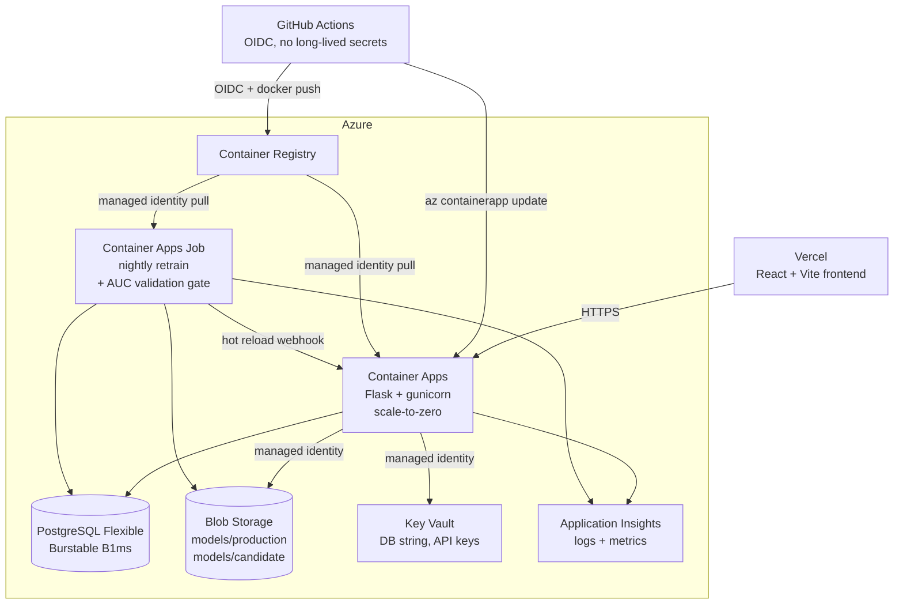

# Football Match Predictor

A full-stack machine learning application that predicts football match outcomes across multiple betting markets. Production model is a stacked ensemble (XGBoost + RandomForest with a logistic-regression meta-learner) trained on 9 European leagues with 40,000+ historical matches.


## Live Demo

- **Frontend**: [football-match-predictor-pearl.vercel.app](https://football-match-predictor-pearl.vercel.app)
- **API**: Azure Container Apps (scale-to-zero — first request after idle takes ~5–10 sec to spin up)
- **Model**: Stacked ensemble (XGBoost + Random Forest + Logistic Regression) — AUC 0.79 on 90-day holdout, ~56% accuracy on the 3-class match outcome

## Highlights

- **Hybrid cloud architecture** — Vercel for frontend, Azure for backend, ML, and data
- **Container Apps with managed identity** — zero-trust auth to Storage, Key Vault, ACR (no secrets in env vars)
- **Infrastructure as Code** — full Bicep, `az deployment group create` rebuilds the entire stack
- **CI/CD via GitHub Actions + OIDC** — no long-lived credentials in GitHub
- **MLOps with validation gates** — nightly retraining job trains the same stacked-ensemble architecture as production; new model must hold AUC within 0.02 of the deployed model before promotion
- **Leakage-safe training** — chronological train/test split, TimeSeriesSplit CV for stacking meta-features, constant rest-day imputation, Elo computed only from past matches
- **Model audit trail** — rejected candidates preserved in `models/candidate/` with timestamps; promoted models versioned as `best_model_YYYYMMDDTHHMMSS.pkl` with manifest (`latest.json`) recording AUC before/after, holdout size, and training set size
- **Defensive API surface** — admin endpoints (model reload, fixture refresh) gated by constant-time token check; sanitized error responses (no stack traces or SQL fragments leak to clients); request body capped at 256 KB; query params clamped
- **Observability** — Application Insights with structured logs and custom metrics

## Features

- **Multi-market predictions** — Match result (H/D/A), Double Chance, BTTS, Over/Under 2.5, Half-Time result, Corners, Cards
- **Combo bets** — Result+BTTS, Result+O/U, BTTS+O/U combinations with combined probabilities
- **Smart bet recommendations** — "Best Bet" (highest edge) and "Safest Bet" (highest probability) with reasoning
- **Accumulator builder** — Select bets across matches, calculates combined odds and potential returns
- **Match tagging** — High Confidence, Upset Pick, Banker classifications
- **Nightly retrain + auto-refresh** — Container Apps Job runs at 03:00 UTC: pulls fresh fixtures, retrains the stacked ensemble with TimeSeriesSplit CV, validates AUC against production on a time-based holdout, promotes or rejects
- **9 leagues** — Premier League, Championship, La Liga, Bundesliga, Serie A, Ligue 1, Eredivisie, Primeira Liga, Champions League

## Architecture



## Prediction Markets

| Market | Outcomes | Description |
|--------|----------|-------------|
| Match Result | Home / Draw / Away | Main 1X2 prediction |
| Double Chance | 1X / X2 / 12 | Combined outcome probabilities |
| BTTS | Yes / No | Both teams to score |
| Over/Under 2.5 | Over / Under | Total goals threshold |
| Half-Time Result | Home / Draw / Away | First half prediction |
| Corners O/U | Over / Under 9.5 | Total corners prediction |
| Cards O/U | Over / Under 3.5 | Total cards prediction |
| Combos | 18 combinations | Result+BTTS, Result+O/U, BTTS+O/U |

## Tech Stack

### Backend
- Python 3.12, Flask 3.1, Gunicorn
- SQLAlchemy + PostgreSQL (Azure Flexible Server, client-side connection pooling)
- XGBoost, Scikit-learn, Pandas, NumPy
- football-data.org API (match data)
- azure-identity + azure-storage-blob (model storage via Managed Identity)
- azure-monitor-opentelemetry (structured logs + custom metrics to Application Insights)

### Infrastructure
- Azure Container Apps (scale-to-zero) + Container Apps Jobs (cron retrain at 03:00 UTC)
- Azure PostgreSQL Flexible Server (Burstable B1ms)
- Azure Blob Storage (`models/production/` + `models/candidate/`)
- Azure Key Vault (secrets via managed identity references)
- Azure Container Registry
- Bicep modules in `infra/` — full stack reproducible via `az deployment group create`
- GitHub Actions workflows in `.github/workflows/` (backend.yml + infra.yml, both via OIDC)

### Frontend
- React 19, Vite 6
- Tailwind CSS 4
- React Router 7, Axios

### Deployment
- **Frontend**: Vercel (auto-deploy from GitHub `main`)
- **Backend**: Azure Container Apps (deployed via Bicep + GitHub Actions OIDC)
- **Database**: Azure PostgreSQL Flexible Server (Burstable B1ms)
- **Models**: Azure Blob Storage (`models/production/`, hot-swappable via webhook)
- **Secrets**: Azure Key Vault (no secrets in env vars or git)

## Local development

### Prerequisites
- Python 3.12, Node.js 20+, PostgreSQL 16, API key from [football-data.org](https://www.football-data.org/)

### Run locally

```bash
# Backend
cd backend
python -m venv venv
source venv/bin/activate    # Windows: venv\Scripts\activate
pip install -r requirements.txt
cp .env.example .env        # fill in DATABASE_URL + FOOTBALL_API_KEY
python wsgi.py              # auto-creates schema if missing

# Frontend (new terminal)
cd frontend
npm install
npm run dev
```

The app will be available at `http://localhost:5174` (frontend) and `http://localhost:5000` (API).

### Bootstrap data

If your local database is empty, populate it from the CSVs:

```bash
cd backend
python src/load_data.py            # historical matches → database
python src/load_external_csv.py    # standings, external league data
python src/feature_engineering.py  # compute ML features
python src/model_training.py       # train models (optional — pre-trained .pkl included)
```

## API Endpoints

### Core
| Method | Endpoint | Description |
|--------|----------|-------------|
| GET | `/api/health` | API status and model info |
| GET | `/api/teams` | List all teams |
| GET | `/api/teams/:id` | Team details with stats and recent form |
| GET | `/api/competitions` | List of leagues in database |

### Predictions
| Method | Endpoint | Description |
|--------|----------|-------------|
| POST | `/api/predict` | Predict match result (H/D/A) |
| POST | `/api/predict/markets` | Full multi-market prediction |
| GET | `/api/predictions/upcoming` | Dashboard — batch predictions for next 3 days |
| GET | `/api/predictions/history` | Past predictions with accuracy |

### Matches
| Method | Endpoint | Description |
|--------|----------|-------------|
| GET | `/api/matches` | List matches (filter by season, team, status) |
| GET | `/api/matches/:id` | Match details with features |
| GET | `/api/matches/upcoming` | Raw upcoming matches |

### Statistics
| Method | Endpoint | Description |
|--------|----------|-------------|
| GET | `/api/statistics/overview` | League-wide match and goal stats |
| GET | `/api/statistics/head-to-head` | H2H record between two teams |

### Admin (require `X-Reload-Token` header)
| Method | Endpoint | Description |
|--------|----------|-------------|
| POST | `/api/admin/reload-model` | Hot-reload the model from Blob without restarting the container — called by the retrain job after a successful promotion |
| POST | `/api/fixtures/refresh` | Sync upcoming fixtures from football-data.org into the DB. Auth-gated because the endpoint burns external-API quota and clears the prediction cache |

## Features Used by ML Model

| Feature | Description |
|---------|-------------|
| Home/Away Form | Win rate over last 5 matches |
| Goals Scored/Conceded | Average per match |
| Home/Away Win Rate | Historical win percentage at venue |
| Head-to-Head Record | Historical record between teams |
| Days Since Last Match | Rest days before the match |
| Elo Rating | Team strength rating |
| League Standings | Current league position and points |

## Project Structure

```
FootballMatchPredictor/
├── backend/
│   ├── Dockerfile                  # Multi-stage build for Container Apps
│   ├── models/                     # Pre-trained ML models (.pkl, also in Blob)
│   │   ├── best_model.pkl          # Main XGBoost match result model
│   │   └── multi_market_models.pkl # BTTS, O/U, corners, cards models
│   ├── src/
│   │   ├── app.py                  # Flask API
│   │   ├── database.py             # SQLAlchemy models & DB manager
│   │   ├── data_collection.py      # football-data.org API client
│   │   ├── feature_engineering.py  # Feature computation pipeline
│   │   ├── prediction_service.py   # Multi-market prediction engine
│   │   ├── cache.py                # In-memory TTL prediction cache (2h)
│   │   ├── load_data.py            # CSV → database loader
│   │   ├── load_external_csv.py    # External league data loader
│   │   ├── model_training.py       # Model training & evaluation
│   │   ├── model_storage.py        # Blob storage abstraction (Managed Identity)
│   │   └── telemetry.py            # Application Insights wiring
│   ├── jobs/
│   │   ├── Dockerfile              # Retrain job container
│   │   └── retrain.py              # Nightly retrain + AUC validation gate
│   ├── requirements.txt
│   ├── wsgi.py
│   └── gunicorn.conf.py
├── frontend/
│   ├── Dockerfile                  # Multi-stage build (used for parity, prod is Vercel)
│   ├── nginx.conf
│   ├── src/
│   │   ├── components/             # MatchCard, MatchDetail, FilterBar, AboutModel, etc.
│   │   ├── pages/Dashboard.jsx
│   │   ├── services/api.js         # Axios client (uses VITE_API_URL)
│   │   ├── utils/constants.js
│   │   ├── App.jsx
│   │   └── main.jsx
│   ├── vercel.json
│   └── package.json
├── infra/                          # Bicep IaC
│   ├── main.bicep                  # Composes all modules
│   ├── main.parameters.prod.json
│   └── modules/
│       ├── acr.bicep
│       ├── appInsights.bicep
│       ├── containerApp.bicep      # CA + Key Vault secret refs (RBAC granted out-of-band)
│       ├── containerAppsEnv.bicep
│       ├── keyVault.bicep
│       ├── logAnalytics.bicep
│       ├── postgres.bicep
│       └── storage.bicep
├── .github/workflows/
│   ├── backend.yml                 # Test + build + push + deploy via OIDC
│   └── infra.yml                   # Bicep deploy via OIDC
├── docker-compose.yml              # Local dev convenience (postgres + backend + frontend)
├── docs/
│   └── azure-runbook.md            # Step-by-step Azure deployment commands
├── LICENSE
└── README.md
```

## Deployment

### Architecture

| Component | Service | Notes |
|---|---|---|
| Frontend | Vercel | Auto-deploys from `main` |
| Backend API | Azure Container Apps | Scale-to-zero, system-assigned managed identity |
| Database | Azure PostgreSQL Flexible Server | Burstable B1ms |
| Model artifacts | Azure Blob Storage | `models/production/`, `models/candidate/` |
| Secrets | Azure Key Vault | DB connection string, API keys, hot-reload token |
| Container registry | Azure Container Registry | Basic SKU |
| Observability | Azure Application Insights | Structured logs, custom metrics |
| Nightly retrain | Azure Container Apps Job | Cron `0 3 * * *`, AUC validation gate |
| CI/CD | GitHub Actions (OIDC) | No long-lived credentials |
| IaC | Azure Bicep | Full stack reproducible from `main.bicep` |

### Deploy from scratch

See [docs/azure-runbook.md](docs/azure-runbook.md) for the complete step-by-step runbook.

Short version:
```powershell
# 1. Provision everything (also seeds Key Vault secrets)
az deployment group create `
  --resource-group rg-fotballpred-prod `
  --template-file infra/main.bicep `
  --parameters infra/main.parameters.prod.json `
  --parameters postgresAdminPassword=<...> footballApiKey=<...>

# 2. Grant the Container App's system-assigned identity the three runtime roles.
#    Bicep can't create role assignments without 'Role Based Access Control Admin'
#    on the deploying identity, so it's a one-time manual step.
$CA_OID = az containerapp show -g rg-fotballpred-prod -n ca-fotballpred-prod --query identity.principalId -o tsv
az role assignment create --assignee $CA_OID --role "AcrPull"                  --scope <ACR_ID>
az role assignment create --assignee $CA_OID --role "Storage Blob Data Reader" --scope <SA_ID>
az role assignment create --assignee $CA_OID --role "Key Vault Secrets User"   --scope <KV_ID>

# 3. Build + push backend image (or let GitHub Actions do it)
docker build -t fotballpred-backend:v1 ./backend
az acr login --name acrfotballpredprod
docker tag fotballpred-backend:v1 acrfotballpredprod.azurecr.io/fotballpred-backend:latest
docker push acrfotballpredprod.azurecr.io/fotballpred-backend:latest

# 4. Migrate DB + upload models (one-time)
pg_restore ...
az storage blob upload ...

# 5. Vercel: set VITE_API_URL=https://<container-app-fqdn>/api, redeploy
```

### Continuous deployment

Push to `main` triggers `.github/workflows/backend.yml`:
1. Lint + test against ephemeral Postgres
2. Build Docker image, push to ACR with commit SHA tag
3. Update Container App revision
4. Smoke-test `/api/health`

## Author

**Adrian Klo Gamst** — Recent UiO informatics graduate, based in Oslo.

- 🌐 [adrianklogamst.no](https://adrianklogamst.no) (portfolio)
- 💼 [LinkedIn](https://linkedin.com/in/adrian-klo-gamst)
- 🐙 [@Gamsty](https://github.com/Gamsty)
- ✉️ gamsten55@outlook.com

Open to graduate, junior, and internship engineering roles starting 2026.

## Acknowledgments

- [Football-Data.org](https://www.football-data.org/) for the football data API
- Data from 9 European leagues (2021–2025 seasons)

## License

MIT — see [LICENSE](LICENSE).

---

Built with Python, React, and machine learning.
